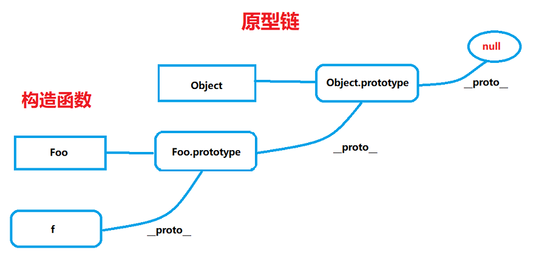
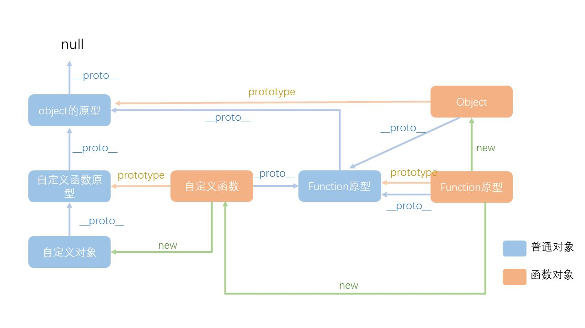

# js

面试题

**typeof 可以得到那些类型**

- [ ] 数据类型

**什么时候===和==**

- [ ] 强制类型转换

**window.onload和DOMContentLoaded的区别**

- [ ] 浏览器渲染过程

**js创建10个a标签，点击弹出对应序号**

- [ ] 作用域

**实现一个模块加载器，实现类试require.js的基本功能**

- [ ] js模块化

**实现数组的随机排序**

- [ ] js基础算法


## 基础知识


### 值类型vs引用类型

var a =20;

b = a;

var a = {age:20};// 引用类型，重复使用空间

var b = a ;

b.age = 20;


### typeof 6种

只能区分值类型前4，引用类型（对象，数组，函数）只能区分出function，不能区分null, {}, []

 1 undefined,  2 string,  3 number,  4 boolean,  5 ( object--null也是object , {}, [] )，6 function

函数是特殊的引用类型


### 变量计算（强制类型转换）

字符串拼接

100+‘10’


==运算符

100 ==“100”  //true

0 == “”  //true

null == undefined   //true

（jq推荐：判断时，null与undefined用==，其他用全等）


if语句强制转换

a =true; a = 100; //true

 a = ' '; // false

0 ， NaN， ‘ ’，null ， undefined // false


逻辑运算符

10&0 //0

‘ ’ || ‘abc’  //'abc'

!window.abc //true

判断变量是否被当作true

var a =100;

console.log(!!a);


js内置函数，数据类对象

Object，Array，Boolean，Number，String，Function，Date，RegExp，Error


内置对象JSON, Math

JSON（Js的对象，2个api）既是对象也是一种数据格式

JSON.stringify({a:10, b:20}) 把字符串转换对象

JSON.parse('{"a":10, "b":20}') 把对象转换字符串


### 原型，原型链


- 如何准确判断一个变量是数组类型（arr instanceof Array）用typeof只能判断是object
- 写一个原型链继承的demo（）

```javascript
function Animal(){
    this.eat = function(){
        console.log('animal eat')
    }
}
function Dog(){
    this.bark = function(){
        console.log('dog bark')
    }
}
Dog.prototype = new Animal()

var hashiqi = new Dog()
// hashiqi.eat()  //原型链的继承
```

贴近实战的例子: 封装dom查询

```javascript
function Elem(id) {
	this.elem = document.getElementById(id)
}

Elem.prototype.html = function (val) {
    // 先获取元素
    var elem = this.elem
    if (val) {
        elem.innerHtml=val
        return this //链式操作
    } else {
        return elem.innerHtml
    }
}
Elem.prototype.on = function (type, fn) {
    var elem = this.elem;
    //事件绑定
    elem.addEventListener(type, fn);
    return this
}
var div1 = new Elem('div1')
// console.log(div1.html())
div1.html('<p>hello</p>').on('click', function(){
    alert('click')
}).html('<p>javascript</p>')
```


- 描述new一个对象的过程

>  创建一个新对象 ==>this 指向这个新对象 ==> 执行代码对this赋值 ==> 返回this

- zepto（或其他框架）源码中如何使用原型链


构造函数及扩展

原型规则及示例

原型链

instanceof


#### 构造函数：大写字母开头的函数

```javascript
function Foo(name, age) {
	this.name = name;
	this.age = age;
	this.class = 'class-1'
	// return this //默认有这一行
}
var f = new Foo('zhang', 20);
// var f1 = new Foo('li', 30);
```

#### 扩展

```javascript
// 推荐前面的方式写定义
var a = {}; //var a = new Object()的语法糖
var a = []; //var a = new Array()的语法糖
function Foo(){...}; //var Foo = new Function(...)的语法糖
// 使用instanceof判断一个函数是否是一个变量的构造函数
```


#### 原型的规则

- 所有引用类型（数组，对象，函数，）都具有对象特性（除null外）可自由扩展属性，

- 所有引用类型都有一个隐式属性```__proto__```属性，属性值是一个普通对象

- 所有函数都具有显式属性prototype，属性值是一个普通对象

- 所有引用对象的```__proto__```属性值指向他的构造函数的prototype属性值

```console.log(obj.__proto__ === Object.prototype)``` 

- 当试图得到一个对象的某个属性时，如果这个对象本身没有这个属性，那么他会去寻找```__proto__```属性即他的构造函数的prototype中寻找

```javascript
function Foo(name, age) {
    this.name = name;
}
Foo.prototype.alertName = function () {
    alert(this.name);
}
var f = new Foo('张山');
f.printName = function () {
    console.log(this.name);
}
f.printName();
f.alertName();

// 对象自身的属性
var item;
for (item in f){
    // 高级浏览器在for in 中屏蔽了来自原型的属性
    // 加上这个判断自身的属性，保证程序的健壮
    if (f.hasOwnProperty(item)) {
        //剔除alearName
        console.log(item)
    }
}

f.toString(); //要去f.__proto__.__proto__中找
```







#### instanceof

```javascript
f instanceof Foo // true
// f的__proto__一层层往上找是否能找到Foo.prototype，找到则true
f instanceof Object // true
```


### 作用域闭包

#### 执行机制

```javascript
fn()//不会报错
function fn () {
	//声明,被前置
    console.log('fn')
}

fn1()//报错fn1==>undefined
var fn1 = function () {
    //表达式
}

//以下是可能看到的情况，都是正确的
//函数声明格式，变量的声明提前，但函数表达式、构造函数不会声明提前
fn2('张山')
function fn2 (name) {
	age = 10
    console.log(name, age)
    var age
    bar(100)
    function bar(num) {
        console.log(num)
    }
}
```


#### 执行上下文

范围：一段script或者一个函数

全局：变量定义，函数声明

函数：变量定义，函数声明，this，arguments


#### this

this要在执行时才能确认值，定义时无法确认，this 是 “**指向调用时所在函数所绑定的对象**”

```javascript
function Foo(name){
    this.name=name//作为构造函数执行，this = {}
}

var a = {
    name: 'A',
    fn: function (){
        console.log(this)
    }
}
a.name // 作为对象属性执行
a.fn() //this === a //作为对象属性执行
a.fn.call({name: 'B'}, '张山') //this==={name: 'B'} //call/apply/bind

var fn1 = a.fn
fn1() //this === window //作为普通函数执行

//call
function fn1(name){
    alert(name)
    console.log(this)
}
fn1.call({x:100}, 'zhangshan')

//bind
var fn2 = function (name){
    alert(name)
    console.log(this)
}.bind({x:200})
fn2('lisi')
```


#### 作用域

没有块级作用域，只有函数和全局作用域

#### 作用域链

```javascript
var a = 100
function F1(){
    var b = 200
    function F2 () {
        var c = 300
        console.log(a)//F2没有，在上一层作用域找，F1没有，全局找
        console.log(b)
        console.log(c)
    }
}
```


当前作用域没有被定义的变量即自由变量，例如在函数作用域里没有变量a的定义，而全局作用域有a的定义，

如果在函数内对a操作，先从当前作用域找，没有，在他的父亲作用域找，一直到全局作用域，就是作用域链

如果还没有，会报错


#### 代码优化


从作用域链的结构可以看出，在运行期上下文的作用域链中，标识符所在的位置越深，读写速度就会越慢。因为**全**

**局变量**总是存在于运行期**上下文作用域链的最末端**，因此在标识符解析的时候，查找全局变量是最慢的。所以，在

编写代码的时候应尽量少使用全局变量，尽可能使用局部变量。


一个好的经验法则是：如果一个跨作用域的对象被引用了一次以上，则先把它存储到局部变量里再使用。


#### 闭包

```javascript
function F1(){
    var a=100
    return function () {
        console.log(a) // 自由变量到父作用域找
    }
}
// f1得到一个函数
var f1 = F1()
var a = 200
f1() // 100
```

```javascript
// 实际开发闭包的应用,封装变量，收敛权限
function isFirstLoad(){
    var _list = []
    return function (id){
        // 如果要检索的字符串值没有出现，则该方法返回 -1。
        if ( _list.indexof(id)>=0 ){
            return False
        } else {
            _list.push(id)
            return true
        }
    }
}
var firstLoad = isFirstLoad()
firstLoad(10) // true
firstLoad(10) // false
firstLoad(20) // true
```


创建10个a标签点击时弹出对应序号

```javascript
var i, a
for (i=0;i<10;i++){
    
    (function(i){
        //函数作用域
        a = document.createElement('a')
    	a.interHtml = i +'<br>'
   		a.addEventListener('click', function(e){
        // 取消a标签的默认动作
        e.preventDefault()
        alert(i)
    	})
   	 	document.body.appendChild(a)
    })(i)
    
}
```


### 异步单线程

题目：

- 同步异步区别，例子
- setTimeout
- 异步场景


#### 同步异步

同步阻塞代码执行（等待alert），异步不堵塞

正常执行是堵塞的，即同步，一步一步执行，

setTimeout(函数，1000)，就是异步


异步：在可能发生等待的情况，都需要异步

- 定时任务（setTimeout，setInverval）
- 网络请求，Ajax请求，动态加载
- 事件绑定

~~~JavaScript
//ajax请求
console.log('start')
$.get('./data1.json', function(data1){
    console.log(data1)
})
console.log('end')


//img加载
console.log('start')
var img = document.createElement('img')
img.onload = function (){
    console.log('loaded')
}
img.src = '/xxx.jpg'
console.log('end')


//事件绑定
console.log('start')
document.getElementById('btn1').addEventListener('click', function(){
    alert('clicked')
})
console.log('end')
~~~


#### 异步单线程

一个一个排队来，不能同时干两件事

异步的任务暂存起来，

```javascript
console.log(1)
setTimeout(function(){console.log(2)})
console.log(3)
setTimeout(function(){console.log(4)},1000)
console.log(5)
//13524
```


#### 日期和math

获取2017-06-10格式的日期

```javascript
function formatDate(dt){
    if(dt){
        dt = new Date()
    }
    var year = dt.getFullYear()   //年
	var month = dt.getMonth()+1   //月（得到的数值与实际差1，要得到实际的月份+1）
	var date = dt.getDate()       //日
    if(month < 10) {
        month = '0'+month
    }
    if(date<10) {
        date = '0' +date
	}
    return year +'-'+month+'-'+date
}
var dt = new Date()
formatDate(dt)
```


获取随机数，要求长度一致的字符串格式

```javascript
var random = Math.random()
var random = random + '0000000000'
var random = random.slice(0,10)
console.log(random)
```


```javascript
Date.now()        //获取当前时间毫秒数
var dt = new Date()
console.log(dt)   //国外写法
dt.getTime()      //获取毫秒数
dt.getFullYear()  //年
dt.getMonth()     //月（得到的数值与实际差1，要得到实际的月份+1）
dt.getDate()      //日
dt.getHours()     //时
dt.getMinutes()   //分
dt.getSeconds()   //秒
```

```javascript
// 清除缓存
Math.random()
```

#### 数组操作


```javascript
// array.forEach(function(currentValue, index, arr), thisValue)
// 必需,当前元素
// 可选,当前元素的索引值
// 可选,当前元素所属的数组对象
// 可选,传递给函数的值一般用 "this" 值。如果这个参数为空， "undefined" 会传递给 "this" 值
// forEach() 对于空数组是不会执行回调函数的
var arr = [1, 2, 3, 4]
arr.forEach(function(item, index){
    console.log(index, item)
})

//every
var result=arr.every(function(item, index){
    if (item<5){
        return true
    }
})
console.log(result)

//some
var result=arr.some(function(item, index){
    if (item<3){
        return true
    }
})
console.log(result)

//sort
var points = [40,100,1,5,25,10]
var results=points.sort(function(a,b){
    return a-b//b-a大到小
});
console.log(results)

//reverse
array.reverse()//逆序

//map
// array.map(function(currentValue,index,arr), thisValue)
arr.map(function(item){
    return '<b>'+item+'</b>'
})

//filter过滤
var result=arr.filter(function(item, index){
    if (item > 2){
        return true
    }
})
console.log(result)
```

#### 对象操作

```javascript
var obj = {x:100,y:200,z:300}
var key
for (key in obj) {
    if(obj.hasOwnProperty(key)){
        console.log(key, obj[key])
    }
}
```


写一个遍历对象和数组的通用forEach

```javascript
///加判断，数组还是对象 //**instanceof**
function forEach(obj, fn){
    var key
    if (obj instanceof Array){
        obj.forEach(function(item, index){
            fn(index, item)
        })
    } else {
        for (key in obj){
            if (obj.hasOwnProperty(key)){
                fn(key, obj[key])
            }
        }
    }
}

var arr = [3, 9, 10, 1]
forEach(arr, function(index,item){
    console.log(index, item)
})
var obj = {x:100,y:200}
forEach(obj, function(index, item){ //用key/val更加容易分辨
	console.log(index, item)
})
```


## js web-api

w3c标准没有规定js基础相关的东西，只管浏览器js操作页面的API和全局变量

ECMA262标准：基础知识


### DOM

Document，Object，Model

- Dom是哪种基本数据结构？

树形结构

- Dom的API

- Dom节点的attr和property区别

  attribute是HTML标签上的特性，它的值只能够是字符串；

getAttribute('name')/setAttribute('style', 'font-size:30px')...

​		property是DOM中的属性，是JavaScript里的对象；

p.className/p.nodeName/p.style.width...


#### DOM节点操作

元素

document.getElementById('div1')

document.querySelector('p')  只返回匹配的第一个元素，如果没有匹配项，返回null  H5新增


集合

document.getElementByTagName('div')

document.getElementByClassName('.container')

document.querySlecterAll('p')

document.querySlecterAll('p,  span')

```javascript
var obj = document.querySelector("#id");
var obj = document.querySelector(".classname");
var obj = document.querySelector("div");
var el = document.body.querySelector("style[type='text/css'], style:not([type])");
var elements = document.querySelectorAll("#score>tbody>tr>td:nth-of-type(2)");
var elements = document.querySelectorAll("#id1, #id2, .class1, class2, div a, #list li img")
```

#### DOM结构操作

新增节点/获取父节点/获取子节点/删除节点

```html
<div id='div1'>
    <p class='p1'>this is p1</p>
	<p class='p2'>this is p1</p>
</div>
<div id='div2'>
    <p class='p3'>this is p1</p>
	<p class='p4'>this is p1</p>
</div>

<script>
    var p4 = document.createElement('p')
	p.innerHtml = 'this is p4'
    //获取父元素 
	var div1 = document.getElementById('div1')
    //新增子元素
	div1.appendChild(p4)
    //p4.parrentElement 获取父元素 
	//div1.childNodes 获取子元素
    //children
	var parent = div1.parentElement
	var child = div1.childNodes
    console.log(child) //包含nodetype的text站位0，2，4
	div1.removeChild(child[1])
</script>

```


### BOM

- 检测浏览器的类型
- 拆解url各部分


navigate

screem

location

history

```javascript
var ua = navigator.userAgent
var isChome = ua.indexOf('Chome')
console.log(isChome)
console.log(screen.width)
console.log(screen.height)

// location
console.log(location.href)
console.log(location.protocol)
console.log(location.pathname)
console.log(location.search)
console.log(location.hash)

history.back()
history.forword()
```


### 事件绑定

- 编写一个通用的事件监听函数
- 描述事件冒泡
- 对无限下拉加载图片绑定，如何给图片绑定事件


```html
<html>

<body>
    <div id='div1'>
    	<a href="http://imooc.com" id='link1'>imooc.com</a>
        <a href="http://imooc.com" id='link2'>imooc.com</a>
        <a href="http://imooc.com" id='link3'>imooc.com</a>
    	<p id='p1'>激活</p>
		<p id='p2'>取消</p>
	</div>
	<div id='div2'>
    	<p id='p3'>取消</p>
		<p id='p4'>取消</p>
	</div>
</body>
<script>
    /* 基本的事件绑定
       事件监听，第三个参数是布尔值，默认false，false是事件冒泡，true是事件捕获
    var a1 = document.getElementById('link1')
    a1.addEventListener('click', function(e) {
        e.preventDefault()
        console.log(123)
    })
    */
    
    /* 封装绑定事件
    function bindEvent(elem, type, fn){
        elem.addEventListener(type, fn)
    }
    
	var link1 = document.getElementById('link1')
    bindEvent(link1, 'click', function(e) {
        e.preventDefault()// 阻止默认行为
        console.log(123)
    })
    */
    /*
    function bindEvent(elem, type, fn){
        elem.addEventListener(type, fn)
    }
    
    var p1 = document.getElementById('p1')
    var body = document.body
    bindEvent(p1, 'click', function(e) {
        e.stopPropagation()// 事件由子元素向祖先元素传播，阻止冒泡
        alert('激活')
    })
    bindEvent(body, 'click', function(e) {
        alert('取消')
    })
    */
    var div1 = document.getElementById('div1')
    bindEvent(div1, 'click', function(e) {
        // 每一个函数内都有一个event事件对象，它有一个target属性，指向事件源
        e.preventDefault()
        // console.log(e.target)
        // target属性是获取触发事件对象的目标，也就是绑定事件的元素，e.target表示该DOM元素，然后在获取其相应的属性值
        // var srcID = event.target.id;
        //所谓的事件委托，通过监听一个父元素，来给不同的子元素绑定事件，减少监听次数，从而提升速度。
        var src = e.target
        if (src.nodeName === 'A') { //src.nodeName.toLowerCase() == 'a'
            console.log('clicked;')
        }
    })
    // 最后说一点，如果元素被阻止冒泡了，千万别去用事件委托的方式监听事件，因为事件委托的原理是利用事件冒泡，当冒泡被阻止，就无法监听了。
    
    // 使用代理重新封装绑定事件
    //代理的好处，1代码简洁，2减少浏览器内存的占用
    function bindEvent(elem, type, selector, fn){
        // 传入参数时，如果selector为空，fn与selector调换位置，
        if (fn == null) {
            fn = selector
            selector = null
        }
        elem.addEventListener(type, function(e){
            var target
            if (selector) {
                // 代理
                target = e.target
                //target是否是符合目标的元素，dom节点是否和选择器匹配
                if (target.matches(selector)) {  
                    fn.call(target, e)// 通过this指向target获取的事件触发的目
                }
            } else {
                //非代理
                fn(e)
            }
        })   
    }
    var div1 = document.getElementById('div1')
    bindEvent(div1,'click','a',function(e){
        preventDefault();
        console.log(this.innerHTML)//this是因为获取的是div1做事件绑定，但是代理的a标签，this指向真正触发标签的a对象
        this.className="active"
    })
</script>

</html>
```


### ajax


- XMLHttpRequest
- 状态码
- 跨域

```javascript
var xhr=new XMLHttpRequest()
xhr.open('OPEN', '/api', false)
xhr.onreadystatechage = function (){
    if(xhr.readyState == 4){ // 状态值
        if(xhr.status==200){ // 状态码
            alert(xhr.responseText)
        }
    }
}
xhr.send(null)
```

跨域

浏览器都有同源策略，不允许ajax访问其他域接口

跨域条件：协议，域名，端口，有一个不同就算跨域


允许跨域加载资源：``` / <link href=...> / <script src=...>```

- img用于打点统计，统计网站可能是其他域
- link/script可以使用CDN，CDN也可能也是其他域
- script可以用于JSONP

所有跨域请求必须经过信息提供方允许


JSONP实现

```html
<script>
    window.callback = function (data){
        console.log(data)
    }
</script>
<script src="http://coding.m.imooc.com/api.js"></script>
```

服务器端设置http  header（后端）


### 存储

cookie，sessionStorage，localStorage区别

cookie本身用于客户端和服务端通信，有本地存储的功能，太小，效率，API简单，需要封装

sessionStorage，localStorage 最大5M，只作为存储，不会携带到Ajax，API简单


## 开发环境


webstom

vscode

sublime


### 版本管理

git

git add . 

git checkout xxx 撤销

git commit -m "xxx"

git push origin master / git pull origin master  


git branch

git checkout -b xxx / git checkout xxx

git merge xxx


coding.net演示

```html
<!-- 注册，-->
```


### 模块化


全局变量的污染


AMD：异步模块

优点：

- 适合在浏览器环境中异步加载模块
- 可以并行加载多个模块

缺点：

- 提高了开发成本，代码的阅读和书写比较困难，模块定义方式的语义不顺畅
- 不符合通用的模块化思维方式，是一种妥协的实现

实现：

- [RequireJS](http://requirejs.org/)
- [curl](https://github.com/cujojs/curl)


CommonJS：

优点：

- 服务器端模块便于重用
- [NPM](https://www.npmjs.com/) 中已经有将近20万个可以使用模块包
- 简单并容易使用

缺点：

- 同步的模块加载方式不适合在浏览器环境中，同步意味着阻塞加载，浏览器资源是异步加载的
- 不能非阻塞的并行加载多个模块

实现：

- 服务器端的 [Node.js](http://www.nodejs.org/)
- [Browserify](http://browserify.org/)，浏览器端的 CommonJS 实现，可以使用 NPM 的模块，但是编译打包后的文件体积可能很大
- [modules-webmake](https://github.com/medikoo/modules-webmake)，类似Browserify，还不如 Browserify 灵活
- [wreq](https://github.com/substack/wreq)，Browserify 的前身


### 打包工具

grunt/gulp

webpack


npm安装，下载node.js安装。。。

```cmd
npm -v // 版本
npm install npm@版本（latest） -g  // 更新（最新）-g全局 // npm update jquery
打开vscode找到项目文件夹，
npm init -y（yes）// 初始化
npm i（install） jquery --save // 安装包
npm i jquery@1.2.0
npm i webpack --save-dev // webpack
npm list //查看包列表
npm uninstall jquery //卸载包
```


## 运行环境

页面加载过程

- 从输入url到html的过程

> 浏览器根据DNS服务器得到域名的IP地址
>
> 建立连接
>
> 发送请求
>
> 接收数据

页面渲染

> 由Html结构 生成DOM Tree
>
> 根据CSS生成CSSOM
>
> 将DOM和CSSOM整合成RenderTree
>
> 根据RenderTree渲染展示
>
> 遇到<script>执行并阻塞渲染


- window.onload和DOMContentLoaded的区别

> window.onload：页面资源全部加载完成执行，包括图片视频等
>
> DOMContentLoaded：DOM渲染完成即执行，如果网速慢或网页资源太多就可以使用这个来优化


### 性能优化

多使用内存，缓存或者其他方法

减少cpu计算，减少网络

- 加载页面和静态资源

静态资源压缩（文件大小），资源合并（减少请求）

静态资源缓存：通过连接名称控制缓存，只有内容改变时才改变名称

使用CDN让资源加载更快

SSR后端渲染，数据直接传输到HTML中

- 渲染优化

CSS放前，js放后

懒加载

```html

// 用轻量级的图片preview.png占位
<script>
    var img1 = document.getElementById('img1')
    img1.src = img1.getAttribute('data-realsrc')
</script>
```

减少DOM查询：对DOM查询做缓存，

合并DOM插入


事件节流：停顿执行事件，减少计算


尽早执行操作（如DOMContentLoaded）


## 安全性

场景：

xss跨站请求攻击：可输入脚本deng；防御，替换''<''为"&lt" ,''>''为"&gt"

xsrf跨站伪造：增加验证流程，指纹，短信验证码等


加班就像借钱，救急不救穷

